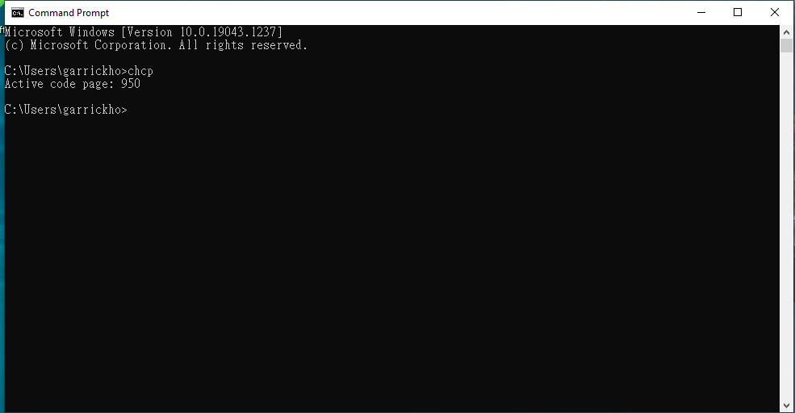

### Change:

Previously, error occurred if running lab_6382339E_1.py in lab PC.

Now, it is resolved.

### Advance topic:

The Window system in our lab is using code page cp950.

You can check this by typing the following command

```
C:\Users\garrickho> chcp
```

which shows the active code page.




Previously, the following file

```
lab05/src/test.txt
```

is encoded by utf-8.

```
src % file test.txt 
test.txt: UTF-8 Unicode text
```

Therefore, if we run the python program, lab_6382339E_1.py, in the lab PC, we will get an error.

In order to resolve this issue, I have changed the file encoding method to ASCII.

```
src % file test.txt 
test.txt: ASCII text
```

#### Note:

Code page cp950 is the code page used on Microsoft Windows for Traditional Chinese, which is, in fact, Big5 encoding.
